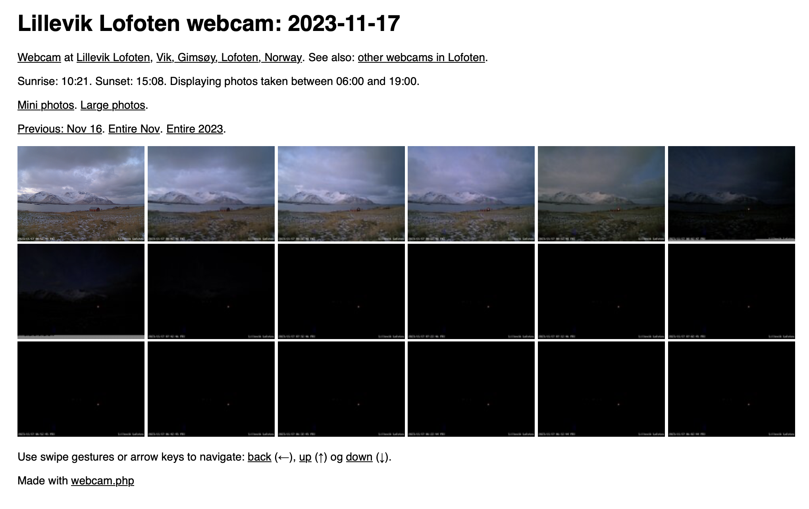

# webcam.php

Generates HTML pages for webcam images in a directory structure like this:
`YYYY/MM/DD/YYYYMMDDHHMMSS.jpg`.

## Highlights

* Finds sunrise, sunset, dawn, and dusk based on latitude and longtitude.
* Only shows images taken between dawn and dusk, handles midnight sun and polar night.
* Navigation with touch gestures and arrow keys.

Example: [Lillevik Lofoten webcam](https://lilleviklofoten.no/webcam/?type=day&date=20231116)

## Todo

* Add a small `HH:MM` CSS overlay on the mini images shown for days, months and years.

Please note: The script started as a simple hack, then grew into this much larger
and bare maintainable hack. It is a good candidate for a complete rewrite if you have the time.

## Things that should be changed if you want to use this

* Add cron jobs for `copy-latest-image.sh` and `rename_and_make_mini_images.sh`.
* Edit the filename in `check_and_rename_files_hack()` that covers for cron when it's too late.
* Update latitude and longitude (use Google Maps to find coordinates)
* Verify the calculated sunrise and sunset at [yr.no](https://www.yr.no/).
* Update the dates in functions `midnight_sun()` and `polar_night()`.
* Change the code for Google and Analytics Microsoft Clarity.
* Update the HTML meta tags.

For verbose feedback for debugging: `$debug = 1`

## Got lots of images you need to sort?

The Bash script `webcam-image-organize-fix.sh` can be a good _starting point_
for reorganizing thousands of images into `YYYY/MM/DD` directories.

## Example screenshot

