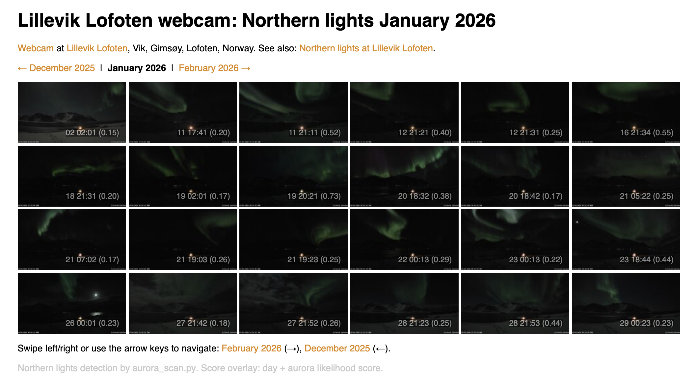
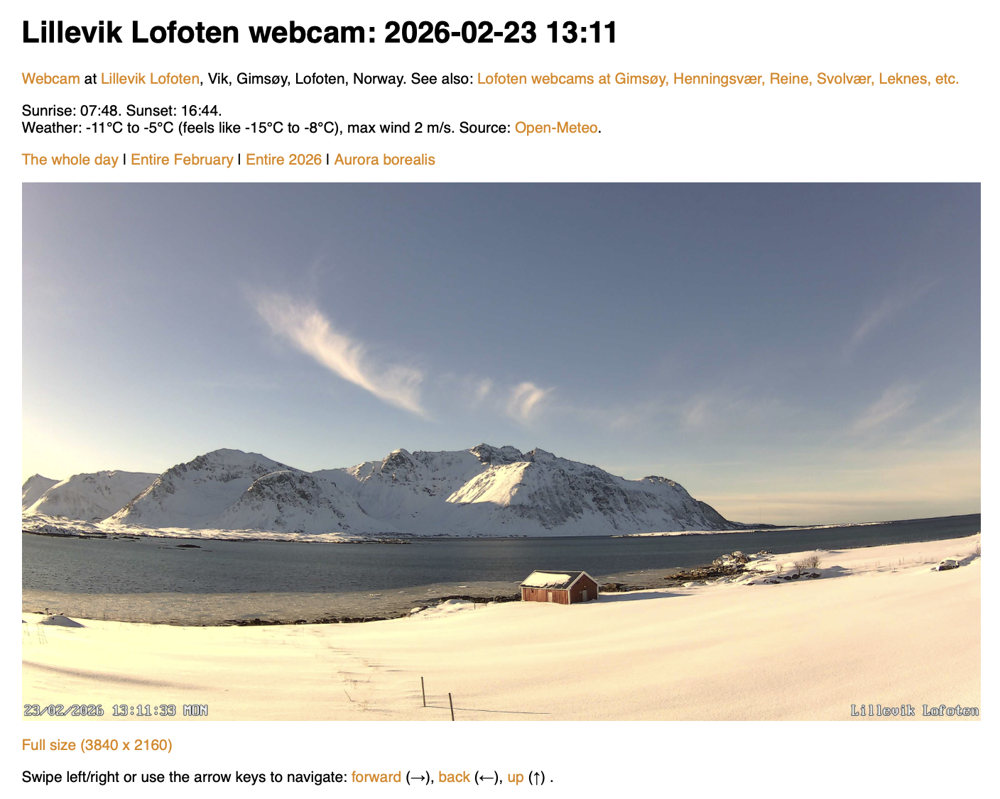
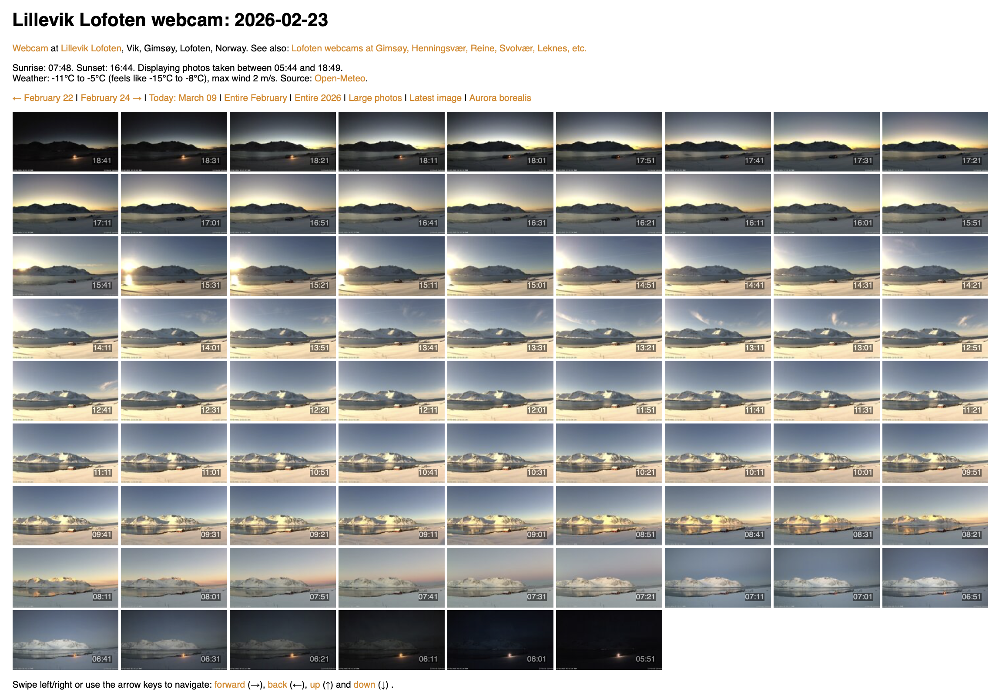
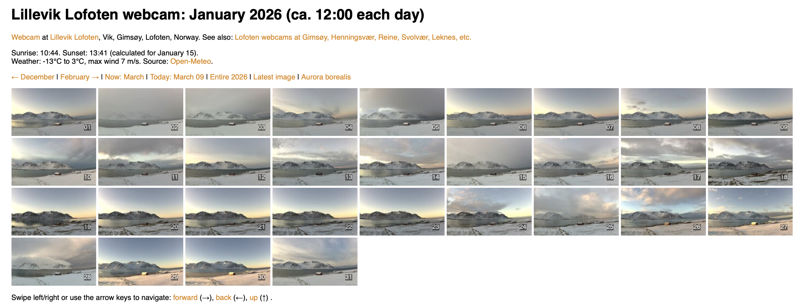

# webcam.php

Generates HTML pages
([examples here](#example-screenshots))
for webcam images stored in a directory structure like this:
`YYYY/MM/DD/YYYYMMDDHHMMSS.jpg`:

```
2023
├── 01
│   ├── 01
│   │   ├── 20230101000000.jpg
│   │   ├── 20230101001000.jpg
│   │   ├── 20230101002000.jpg
[...]
├── 12
│   │   ├── 20231231000000.jpg
│   │   ├── 20231231001000.jpg
│   │   ├── 20231231002000.jpg
[...]
```

## Highlights

* Finds sunrise, sunset, dawn, and dusk based on latitude and longitude.
* Only shows images taken between dawn and dusk, handles midnight sun and polar night.
* Navigation with touch gestures and arrow keys.
* Shows the time (HH:MM) as a CSS overlay on thumbails when viewing a full day, month and year.
* Data collection with Google Analytics and Microsoft Clarity
* **Performance optimizations**: Client-side caching, resource prefetching, and optimized loading (see [PERFORMANCE.md](PERFORMANCE.md))

Example: [Lillevik Lofoten webcam](https://lilleviklofoten.no/webcam/?type=day&date=20231117)

If you like this you can
[buy me a coffee](https://www.buymeacoffee.com/superelectric) ☕️
(you'll be the first)

## Things that should be changed if you want to use this

* Edit
  [`copy-latest-image.sh`](https://github.com/cloveras/webcam/blob/main/cron/copy-latest-image.sh)
  and
  [`rename_and_make_mini_images.sh`](https://github.com/cloveras/webcam/blob/main/cron/rename_and_make_mini_images.sh).
* Add cron jobs for those two scripts. See
  [crontab.txt](util/crontab.txt).
* Edit the filename in `check_and_rename_files_hack()` that covers for cron when it's too slow.
* Update latitude and longitude (use Google Maps to find coordinates)
* Verify the calculated sunrise and sunset at [yr.no](https://www.yr.no/).
* Update the dates in functions `midnight_sun()` and `polar_night()`.
* Change the code for Google and Analytics Microsoft Clarity.
* Update the HTML meta tags.

For verbose feedback for debugging: Set `$debug = 1` in `webcam.php`.

## Code structure

* **`WebcamConfig.php`** — All configuration constants (location, periods, display settings)
* **`SunCalculator.php`** — Sun time calculations (sunrise, sunset, dawn, dusk, handles midnight sun and polar night)
* **`ImageFileManager.php`** — File system operations for finding and organizing images
* **`NavigationHelper.php`** — Navigation and URL generation utilities
* **`webcam.php`** — Main entry point with page rendering functions
* **`aurora.php`** — Northern lights gallery, reads `aurora-YYYY.json` files
* **`aurora_scan.py`** — Scans images and scores each for aurora likelihood
* **`sun_calculator.py`** — Shared Python module mirroring `SunCalculator.php` (same location, same nautical twilight logic); used by `aurora_scan.py`

See [`CODE_STRUCTURE.md`](CODE_STRUCTURE.md) for detailed documentation.

## Aurora borealis gallery

`aurora_scan.py` scans webcam images and scores each one for aurora likelihood using OpenCV (aurora-green hue, local contrast, and connected-component structure). Scores above `--threshold` are saved as `aurora-YYYY.json` and displayed by `aurora.php`.

`aurora.php` automatically loads every `aurora-YYYY.json` file in the same directory, so adding a new year requires only dropping in the JSON file.

### Setup

```bash
python3 -m venv venv && source venv/bin/activate
pip install opencv-python numpy astral
```

### Scanning

**Update a single month** (fast — good for routine updates):

```bash
python3 aurora_scan.py /path/to/images/2026/03 --night --threshold 0.15 --json-output data/aurora-2026.json
```

When `aurora-2026.json` already exists, only the months present in the scan are replaced; all other months are kept. This means you can re-scan January without touching February–December.

**Full year scan** (slow — use for initial build or full rebuild):

```bash
python3 aurora_scan.py /path/to/images/2026 --night --threshold 0.15 --json-output data/aurora-2026.json
```

**Incremental / daily scan** using `--append` (upserts individual timestamps instead of replacing the whole month):

```bash
python3 aurora_scan.py /path/to/images/2026/03/15 --night --threshold 0.15 --append --json-output data/aurora-2026.json
```

### Key options

| Option | Description |
|---|---|
| `--threshold N` | Minimum score to include (0.15 is a reasonable starting point) |
| `--night` | Only scan images taken during darkness (before nautical dawn / after nautical dusk, accounting for midnight sun and polar night) |
| `--limit N` | Cap the stdout report at N results (does not affect JSON output) |
| `--workers N` | Number of parallel workers (default: all CPU cores; try 1–2 for network drives) |
| `--append` | Upsert individual timestamps instead of replacing scanned months |

### Live forecast on aurora.php

When viewing the **current month**, `aurora.php` also shows:

* **Yr aurora forecast** — tonight and tomorrow night, with activity level and cloud cover. Fetched from the Yr API and cached for 30 minutes in `/tmp/yr_aurora_forecast.json`.
* **NOAA/SWPC animated forecast** — the last 24 frames (2 hours at 5-minute intervals) cycling as an animation.

Example: [Northern lights — January 2026](https://lilleviklofoten.no/webcam/aurora.php?year=2026&month=01)



## Got lots of images you need to sort and upload?

The Bash script
[`webcam-image-organize-fix.sh`](https://github.com/cloveras/webcam/blob/main/util/webcam-image-organize-fix.sh)
can be a good _starting point_
for reorganizing thousands of images into `YYYY/MM/DD` directories.

The Bash script
[`util/nctpput-all-images.sh`](https://github.com/cloveras/webcam/blob/main/util/nctpput-all-images.sh)
uses
[`ncftp`](https://www.ncftp.com)
and can be a good _starting point_ for mass-uploading thousands of files.

## Example screenshots

Resized to fit.

A single image: https://lilleviklofoten.no/webcam/?type=one&image=20231126151113



One full day: https://lilleviklofoten.no/webcam/?type=day&date=20231126



One full month: https://lilleviklofoten.no/webcam/?type=month&year=2023&month=11


