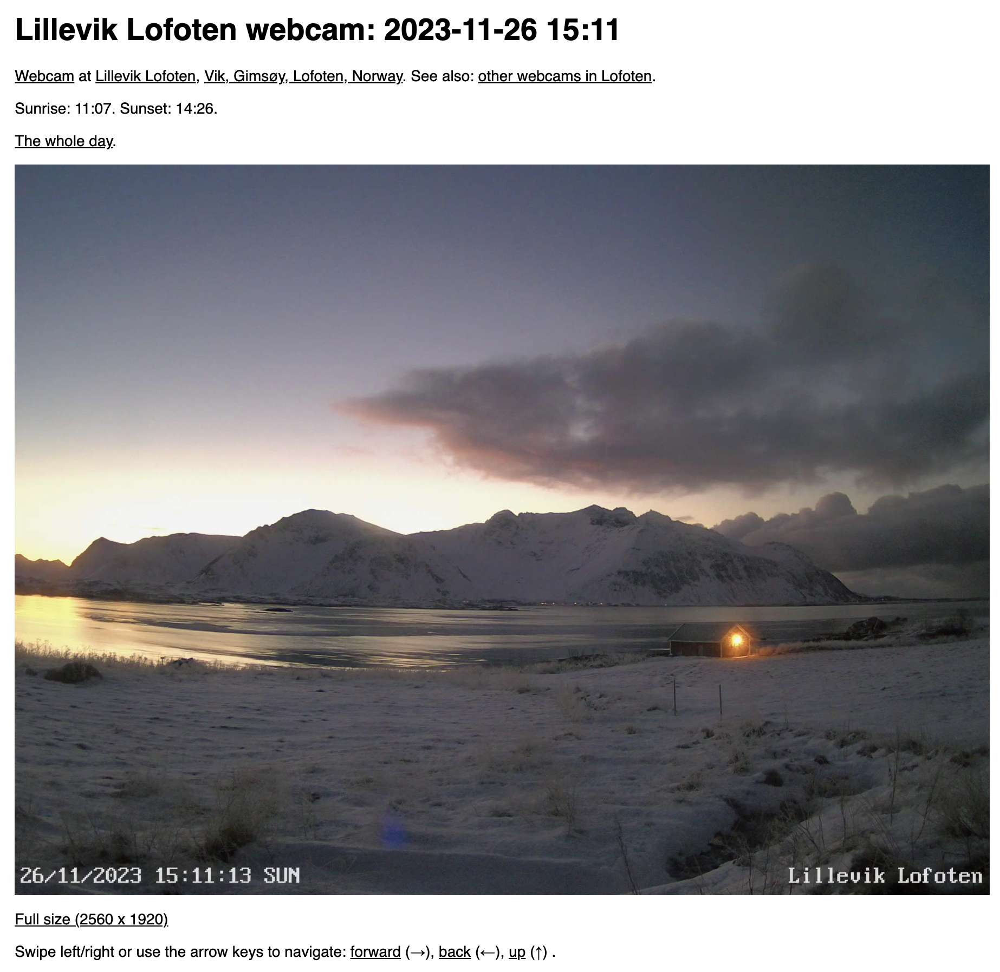
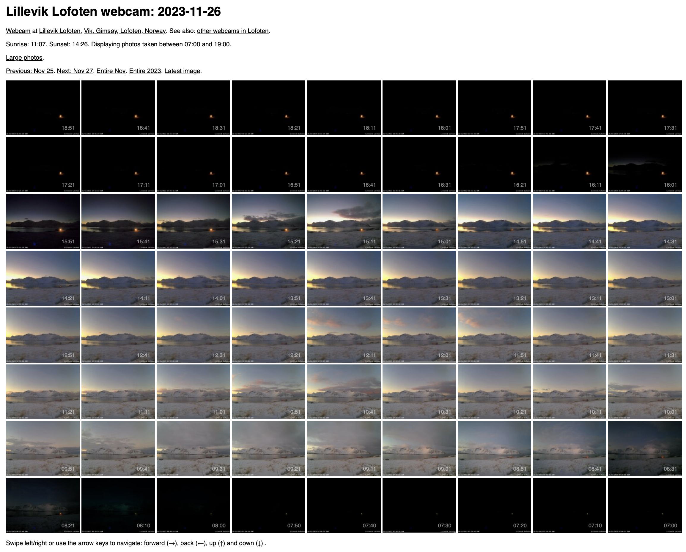
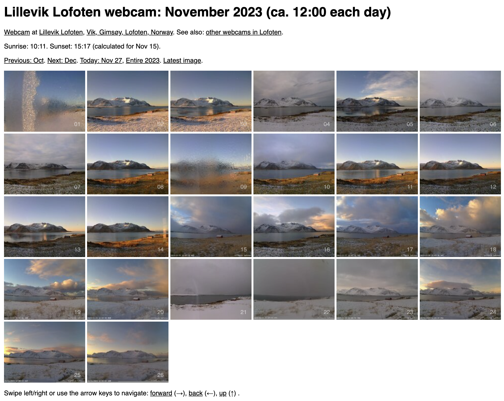

# webcam.php

Generates HTML pages
([examples here](#example-screenshots))
for webcam images stored in a directory structure like this:
`YYYY/MM/DD/YYYYMMDDHHMMSS.jpg`:

```
2023
├── 01
│   ├── 01
│   │   ├── 20230101032215.jpg
│   │   ├── 20230101032721.jpg
│   │   ├── 20230101033228.jpg
[...]
├── 11
│   ├── 17
│   │   ├── 20231117000232.jpg
│   │   ├── 20231117001233.jpg
│   │   ├── 20231117002233.jpg
[...]
```

## Highlights

* Finds sunrise, sunset, dawn, and dusk based on latitude and longitude.
* Only shows images taken between dawn and dusk, handles midnight sun and polar night.
* Navigation with touch gestures and arrow keys.
* Data collection with Google Analytics and Microsoft Clarity

Example: [Lillevik Lofoten webcam](https://lilleviklofoten.no/webcam/?type=day&date=20231117)

If you like this you can
[buy me a coffee](https://www.buymeacoffee.com/superelectric) ☕️

## Todo

* Add a CSS overlay to display `HH:MM` in the lower right corner on the mini images shown for days, months and years.

## Things that should be changed if you want to use this

* Edit
  [`copy-latest-image.sh`](https://github.com/cloveras/webcam/blob/main/cron/copy-latest-image.sh)
  and
  [`rename_and_make_mini_images.sh`](https://github.com/cloveras/webcam/blob/main/cron/rename_and_make_mini_images.sh).
* Add cron jobs for those two scripts. See
  [crontab.txt](util/crontab.txt).
* Edit the filename in `check_and_rename_files_hack()` that covers for cron when it's too slow.
* Update latitude and longitude (use Google Maps to find coordinates)
* Verify the calculated sunrise and sunset at [yr.no](https://www.yr.no/).
* Update the dates in functions `midnight_sun()` and `polar_night()`.
* Change the code for Google and Analytics Microsoft Clarity.
* Update the HTML meta tags.

For verbose feedback for debugging: `$debug = 1`.

Please note: The script started as a simple hack, then grew into this much larger
and barely maintainable hack.  It works well, but the code is not super elegant.
PRs are welcome.

## Got lots of images you need to sort and upload?

The Bash script
[`webcam-image-organize-fix.sh`](https://github.com/cloveras/webcam/blob/main/util/webcam-image-organize-fix.sh)
can be a good _starting point_
for reorganizing thousands of images into `YYYY/MM/DD` directories.

To Bash script
[`util/nctpput-all-images.sh`](https://github.com/cloveras/webcam/blob/main/util/nctpput-all-images.sh)
uses
[`ncftp`](https://www.ncftp.com)
and can be a good _starting point_ for mass-uploading thousands of files.

## Example screenshots

A single image: https://lilleviklofoten.no/webcam/?type=one&image=20231117095251



One full day: https://lilleviklofoten.no/webcam/?type=day&date=20231117



One full month: https://lilleviklofoten.no/webcam/?type=month&year=2023&month=11


